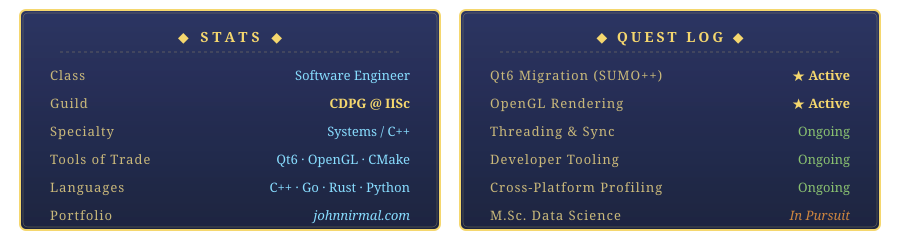

<!--
═══════════════════════════════════════════════════════════════
 John Nirmal — GitHub Profile README
 Theme: The Legend of Zelda: Ocarina of Time (N64)
 SVG assets live in /assets — committed alongside this file.
═══════════════════════════════════════════════════════════════
-->

<!-- ═════════════ ANIMATED STONE TABLET BANNER ═════════════ -->
<p align="center">
  <picture>
    <source media="(prefers-color-scheme: dark)" srcset="./assets/banner-dark.svg" />
    <source media="(prefers-color-scheme: light)" srcset="./assets/banner-light.svg" />
    
  </picture>
</p>

<!-- ═════════════ HUD: Hearts / Magic / Rupees ═════════════ -->
<p align="center">
  <picture>
    <source media="(prefers-color-scheme: dark)" srcset="./assets/hud-dark.svg" />
    <source media="(prefers-color-scheme: light)" srcset="./assets/hud-light.svg" />
    
  </picture>
</p>

<!-- ═════════════ LINKS ═════════════ -->
<p align="center">
  <a href="https://johnnirmal.com"></a>
  <a href="https://linkedin.com/in/john-nirmal"></a>
  <a href="https://twitter.com/john__ni7"></a>
  <a href="https://stackoverflow.com/users/4415947"></a>
</p>

<p align="center">
  
</p>

<!-- ═════════════ DIVIDER ═════════════ -->
<p align="center"></p>

## 📜 Tale of the Hero

```cpp
// Excerpt from the ancient codex
class JohnNirmal {
public:
    std::string title  = "Software Engineer @ CDPG, IISc";
    std::string realm  = "Bengaluru, Hyrule";
    std::string quest  = "Modernize the legacy. Master the threads.";

    std::vector<std::string> equipped = {
        "Modern C++", "Qt6", "OpenGL", "Systems Programming",
        "Performance Debugging", "Fullstack Engineering"
    };

    void embark() {
        while (curious) { learn(); ship(); repeat(); }
    }
};
```

A Software Engineer at **CDPG, IISc**, currently on a grand quest to modernize legacy C++ GUI systems — porting from FOX Toolkit to **Qt6**, working with **OpenGL** rendering pipelines, and chasing safer threading across Windows, Linux, and macOS. Portfolio: [johnnirmal.com](https://johnnirmal.com).

<!-- ═════════════ DIVIDER ═════════════ -->
<p align="center"></p>

## ◆ Subscreen

<p align="center">
  <picture>
    <source media="(prefers-color-scheme: dark)" srcset="./assets/panels-dark.svg" />
    <source media="(prefers-color-scheme: light)" srcset="./assets/panels-light.svg" />
    
  </picture>
</p>

<!-- ═════════════ DIVIDER ═════════════ -->
<p align="center"></p>

## ⚔️ Equipped Items & Spells

<h4 align="center">— Weapons & Armor —</h4>
<table align="center">
  <tr>
    <td align="center" width="80"><a href="https://www.w3schools.com/cpp/" target="_blank"></a><br/>C++</td>
    <td align="center" width="80"><a href="https://www.java.com" target="_blank"></a><br/>Java</td>
    <td align="center" width="80"><a href="https://www.python.org" target="_blank"></a><br/>Python</td>
    <td align="center" width="80"><a href="https://go.dev" target="_blank"></a><br/>Go</td>
    <td align="center" width="80"><a href="https://www.rust-lang.org" target="_blank"></a><br/>Rust</td>
    <td align="center" width="80"><a href="https://www.linux.org/" target="_blank"></a><br/>Linux</td>
    <td align="center" width="80"><a href="https://www.docker.com/" target="_blank"></a><br/>Docker</td>
    <td align="center" width="80"><a href="https://www.gnu.org/software/bash/" target="_blank"></a><br/>Bash</td>
    <td align="center" width="80"><a href="https://cmake.org/" target="_blank"></a><br/>CMake</td>
    <td align="center" width="80"><a href="https://www.qt.io/" target="_blank"></a><br/>Qt</td>
    <td align="center" width="80"><a href="https://www.opengl.org/" target="_blank"></a><br/>OpenGL</td>
    <td align="center" width="80"><a href="https://aws.amazon.com" target="_blank"></a><br/>AWS</td>
  </tr>
</table>

<h4 align="center">— Bottles & Potions (Databases & Backend) —</h4>
<table align="center">
  <tr>
    <td align="center" width="80"><a href="https://www.postgresql.org" target="_blank"></a><br/>PostgreSQL</td>
    <td align="center" width="80"><a href="https://www.mongodb.com/" target="_blank"></a><br/>MongoDB</td>
    <td align="center" width="80"><a href="https://www.mysql.com/" target="_blank"></a><br/>MySQL</td>
    <td align="center" width="80"><a href="https://redis.io" target="_blank"></a><br/>Redis</td>
    <td align="center" width="80"><a href="https://spring.io/projects/spring-boot" target="_blank"></a><br/>Spring</td>
    <td align="center" width="80"><a href="https://hibernate.org/" target="_blank"></a><br/>Hibernate</td>
    <td align="center" width="80"><a href="https://nodejs.org" target="_blank"></a><br/>Node.js</td>
    <td align="center" width="80"><a href="https://fastapi.tiangolo.com/" target="_blank"></a><br/>FastAPI</td>
    <td align="center" width="80"><a href="https://www.prisma.io/" target="_blank"></a><br/>Prisma</td>
  </tr>
</table>

<h4 align="center">— Magic Spells (Web & Frontend) —</h4>
<table align="center">
  <tr>
    <td align="center" width="80"><a href="https://reactjs.org/" target="_blank"></a><br/>React</td>
    <td align="center" width="80"><a href="https://nextjs.org/" target="_blank"><picture><source media="(prefers-color-scheme: dark)" srcset="https://raw.githubusercontent.com/devicons/devicon/master/icons/nextjs/nextjs-original-wordmark.svg" /></picture></a><br/>Next.js</td>
    <td align="center" width="80"><a href="https://www.typescriptlang.org/" target="_blank"></a><br/>TypeScript</td>
    <td align="center" width="80"><a href="https://developer.mozilla.org/en-US/docs/Web/JavaScript" target="_blank"></a><br/>JavaScript</td>
    <td align="center" width="80"><a href="https://tailwindcss.com/" target="_blank"></a><br/>Tailwind</td>
    <td align="center" width="80"><a href="https://developer.mozilla.org/en-US/docs/Web/HTML" target="_blank"></a><br/>HTML</td>
    <td align="center" width="80"><a href="https://developer.mozilla.org/en-US/docs/Web/CSS" target="_blank"></a><br/>CSS</td>
  </tr>
</table>

<h4 align="center">— Trinkets (Additional Tools) —</h4>
<table align="center">
  <tr>
    <td align="center" width="80"><a href="https://expressjs.com" target="_blank"><picture><source media="(prefers-color-scheme: dark)" srcset="https://raw.githubusercontent.com/devicons/devicon/master/icons/express/express-original-wordmark.svg" /></picture></a><br/>Express.js</td>
    <td align="center" width="80"><a href="https://graphql.org/" target="_blank"></a><br/>GraphQL</td>
    <td align="center" width="80"><a href="https://redux.js.org/" target="_blank"></a><br/>Redux</td>
    <td align="center" width="80"><a href="https://github.com/features/actions" target="_blank"></a><br/>Actions</td>
    <td align="center" width="80"><a href="https://wails.io/" target="_blank"></a><br/>Wails</td>
    <td align="center" width="80"><a href="https://grpc.io/" target="_blank"></a><br/>gRPC</td>
    <td align="center" width="80"><a href="https://protobuf.dev/" target="_blank"></a><br/>Protobuf</td>
  </tr>
</table>

<!-- ═════════════ DIVIDER ═════════════ -->
<p align="center"></p>

## 🏆 Trophies from the Sage Temples

<p align="center">
  <a href="https://github.com/ryo-ma/github-profile-trophy">
    <picture>
      <source media="(prefers-color-scheme: dark)" srcset="https://github-profile-trophies.vercel.app/?username=ljn7&theme=onedark&no-frame=true&row=1&column=7&margin-w=10" />
      <source media="(prefers-color-scheme: light)" srcset="https://github-profile-trophies.vercel.app/?username=ljn7&theme=flat&no-frame=true&row=1&column=7&margin-w=10" />
      
    </picture>
  </a>
</p>

<!-- ═════════════ DIVIDER ═════════════ -->
<p align="center"></p>

## 📊 Adventurer's Almanac

<p align="center">
  <picture>
    <source media="(prefers-color-scheme: dark)" srcset="https://github-readme-stats-wheat-two-68.vercel.app/api?username=ljn7&show_icons=true&locale=en&hide_border=true&include_all_commits=true&count_private=true&theme=gotham&title_color=f5d76e&icon_color=f5d76e" />
    <source media="(prefers-color-scheme: light)" srcset="https://github-readme-stats-wheat-two-68.vercel.app/api?username=ljn7&show_icons=true&locale=en&hide_border=true&include_all_commits=true&count_private=true&title_color=8b4513&icon_color=8b4513&text_color=3a2a14&bg_color=f5e8c8" />
    
  </picture>
  <picture>
    <source media="(prefers-color-scheme: dark)" srcset="https://github-readme-stats-wheat-two-68.vercel.app/api/top-langs?username=ljn7&show_icons=true&locale=en&layout=compact&hide_border=true&langs_count=8&theme=gotham&title_color=f5d76e" />
    <source media="(prefers-color-scheme: light)" srcset="https://github-readme-stats-wheat-two-68.vercel.app/api/top-langs?username=ljn7&show_icons=true&locale=en&layout=compact&hide_border=true&langs_count=8&title_color=8b4513&text_color=3a2a14&bg_color=f5e8c8" />
    
  </picture>
</p>

<p align="center">
  <picture>
    <source media="(prefers-color-scheme: dark)" srcset="https://github-readme-streak-stats.herokuapp.com/?user=ljn7&theme=gotham&hide_border=true&ring=f5d76e&fire=f5d76e&currStreakLabel=f5d76e" />
    <source media="(prefers-color-scheme: light)" srcset="https://github-readme-streak-stats.herokuapp.com/?user=ljn7&hide_border=true&background=f5e8c8&stroke=8b4513&ring=8b4513&fire=8b4513&currStreakLabel=8b4513&sideLabels=3a2a14&dates=3a2a14&sideNums=3a2a14&currStreakNum=3a2a14" />
    
  </picture>
</p>

<!-- ═════════════ DIVIDER ═════════════ -->
<p align="center"></p>

## 🗝️ Hyrulean Fun Fact

```c
/* A scroll from the ancient codex */
#include <stdio.h>
#define decode(s,t,u,m,p,e,d) m ## s ## u ## t
#define begin decode(a,n,i,m,a,t,e)

int begin() {
    printf("It works!\n");
}
```

<!-- ═════════════ FOOTER ═════════════ -->
<p align="center">
  <i>~ Press Z to target. Press A to continue. ~</i>
</p>